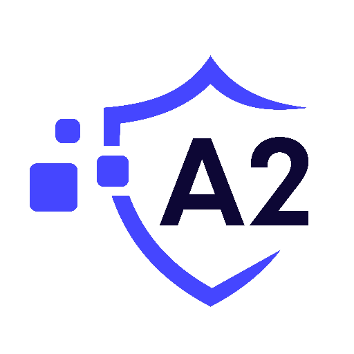

  

## Our Work

###  Competitions 

| Platform       | Contest                | Ranking        | Findings     | Links                                                                                          | Project Type            | Participant |
|----------------|------------------------|----------------|--------------|------------------------------------------------------------------------------------------------|-------------------------|-------------|
| **CodeHawks**   | Stake-Link            | **1st/53** 🥇   | **2H, 1M**   | [Leaderboard](https://www.codehawks.com/contests/clqf7mgla0001yeyfah59c674)                    | **Staking**             | ElHaj       |
| **Cantina**     | ZeroLand              | **1st/41** 🥇   | **2H, 8M**   | [Leaderboard](https://cantina.xyz/leaderboard/a83eaf73-9cbc-495f-8607-e55d4fdaf407)            | **Lending**             | ElHaj       |
| **Immunefi**    | Folks-Finance #2      | **1st/24** 🥇   | **1H**       | N/A                                                                                            | **Lending**             | A2-security |
| **Immunefi**    | Folks-Finance         | **2nd/95** 🥈   | **4H, 3M**   | N/A                                                                                            | **Lending**             | A2-security |
| **Cantina**     | SuperForm             | **2nd/49** 🥈   | **2H, 5M**   | [Leaderboard](https://cantina.xyz/leaderboard/2cd0b038-3e32-4db6-b488-0f85b6f0e49f)            | **Yield**               | ElHaj       |
| **Code4rena**   | Dyad                  | **2nd/223** 🥈  | **5H, 4M**   | [Leaderboard](https://code4rena.com/audits/2024-04-dyad#top)                                   | **Lending**             | Alix40      |
| **N/A**         | PossumLabs            | **2nd/35** 🥈   | **1M**       | [Report](https://github.com/shieldify-security/audits-portfolio/blob/main/reports/PossumLabs-V2-Security-Review.pdf) | **Yield**    | ElHaj       |
| **CodeHawks**   | Steadefi              | **3rd/68** 🥉   | **4H, 7M**   | [Leaderboard](https://www.codehawks.com/contests/clo38mm260001la08daw5cbuf)                    | **Yield**               | ElHaj       |
| **Sherlock**    | PoolTogether          | **4th/168**     | **1H, 3M**   | [Leaderboard](https://audits.sherlock.xyz/contests/225/leaderboard)                            | **Lending**             | ElHaj       |
| **Code4rena**   | SizeCredit            | **4th/192**     | **2H, 5M**   | [Leaderboard](https://code4rena.com/audits/2024-06-size#top)                                   | **Lending**             | ElHaj       |
| **Code4rena**   | Badger                | **4th/74**      | **1M**       | [Leaderboard](https://code4rena.com/audits/2024-06-ebtc-zap-router#top)                         | **Lending**             | Alix40      |
| **Cantina**     | Euler-v2              | **4th/620**     | N/A          | [Leaderboard](https://cantina.xyz/competitions/41306bb9-2bb8-4da6-95c3-66b85e11639f/leaderboard)| **Lending**             | Alix40      |
| **Cantina**     | Wormhole-NTT          | **4th/31**      | **2M**       | N/A                                                                                            | **Cross-Chain**         | ElHaj       |
| **Cantina**     | 3DNS                  | **5th/28**      | **2H, 3M**   | N/A                                                                                            | **Domain**              | ElHaj       |
| **CodeHawks**   | DittoEth              | **5th/80**      | **1H, 2M**   | [Leaderboard](https://www.codehawks.com/contests/clm871gl00001mp081mzjdlwc)                    | **Lending**             | ElHaj       |
| **Cantina**     | Curvance              | **6th/226**     | **7H, 7M**   | [Leaderboard](https://cantina.xyz/competitions/ac757733-81a4-43c7-8f49-17c5b135cdff/leaderboard)| **Lending, Cross-Chain**| Alix40      |
| **Cantina**     | Op-Safe-Extensions    | **7th/74**      | **3M**       | [Leaderboard](https://cantina.xyz/leaderboard/d47f8096-8858-437d-a9f5-2fe85ac9b95e)            | **L2**                  | ElHaj       |
| **CodeHawks**   | Chainlink-CCIP        | **7th/123**     | **1M**       | [Leaderboard](https://www.codehawks.com/contests/clo38mm260001la08daw5cbuf)                    | **Cross-Chain**         | A2-security |
| **CodeHawks**   | The Standard          | -              | **1H**       | [Leaderboard](https://www.codehawks.com/contests/clql6lvyu0001mnje1xpqcuvl)                    | **Lending**             | ElHaj       |
| **Sherlock**    | Exactly-Protocol      | -              | **1H, 6M**   | [Leaderboard](https://audits.sherlock.xyz/contests/247/leaderboard)                            | **Lending**             | ElHaj       |
| **Cantina**     | Aavev3.1              | -              | N/A          | [Leaderboard](https://cantina.xyz/competitions/5ffcedec-7e2e-4717-a3e4-e9041ca541c2/leaderboard)| **Lending**             | Alix40      |
| **Code4rena**   | Size.Credit           | -              | **1H, 6M**   | [Leaderboard](https://code4rena.com/audits/2024-06-size#top)                                   | **Lending**             | Alix40      |
| **Code4rena**   | Revert.Lend           | -              | **1H, 3M**   | [Leaderboard](https://code4rena.com/audits/2024-03-revert-lend#top)                            | **Lending**             | Alix40      |
| **Code4rena**   | Renft                 | -              | **1H**       | [Leaderboard](https://code4rena.com/audits/2024-01-renft#top)                                  | **Lending, NFT**        | Alix40      |

   ###  Pending : 
  | *Platform*   | Contest               | Type Of Competitions | Participant |
  |------------|------------------------|----------------------|------------------------------------|
  | **Sherlock**| Sentiment        | **public**          | A2-security       |
  | **Sherlock**| Zerolend | **public**| A2-security|
